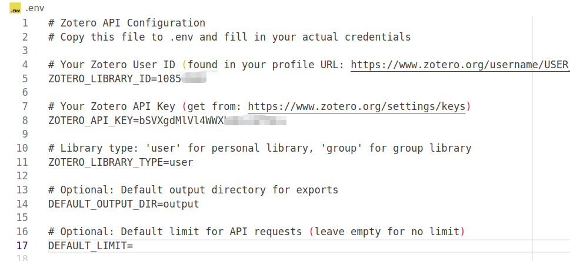

# ZoteroDB-Analyzer

[](https://www.python.org/downloads/)
[](https://opensource.org/licenses/MIT)

> **🌐 Languages**: [English](README.md) | [中文](README_zh.md)

**ZoteroDB-Analyzer** is a powerful Python toolkit designed for academic researchers to automate Zotero literature library analysis and generate high-quality literature reviews. The tool supports LLM agent integration, enabling AI assistants to intelligently help you manage and analyze academic literature.

## 📋 Table of Contents

- [✨ Key Highlights](#-key-highlights)
- [🎯 Features](#-features)
- [📦 Quick Installation](#-quick-installation)
- [🚀 5-Minute Quick Start](#-5-minute-quick-start)
- [💻 Usage Guide](#-usage-guide)
- [🤖 VS Code Copilot Integration](#-vs-code-copilot-integration)
- [🎯 Use Cases](#-use-cases)
- [📚 API Reference](#-api-reference)
- [🤝 Community & Support](#-community--support)
- [📜 License](#-license)
- [🚀 Roadmap](#-roadmap)

## ✨ Key Highlights

- 🚀 **One-Click Configuration**: Simple `.env` file setup, no complex configuration required
- 🤖 **AI Integration**: Native support for VS Code Copilot, Claude, and other LLM agents
- 📊 **Smart Analysis**: Automatic literature categorization and structured review generation
- 🔍 **Powerful Search**: Multi-dimensional filtering and searching of your Zotero library
- 📝 **Multiple Export Formats**: Support for JSON, Markdown, and other LLM-friendly formats

## 🎯 Features

### 🔍 **Smart Literature Management**

- 📚 **Comprehensive Integration**: Seamlessly connect to personal or team Zotero libraries
- 🎯 **Precise Filtering**: Support for multi-dimensional filtering by tags, collections, authors, keywords, and time ranges
- 📊 **Complete Metadata**: Automatic extraction of abstracts, DOIs, BibTeX citations, and other information
- 🔍 **Full Library Search**: Quickly locate target literature

### 🧠 **AI-Driven Categorization**

- 🏷️ **Automatic Classification**: Intelligent literature grouping based on keywords and content
- 📋 **Flexible Schemes**: Support for custom classification systems and multiple criteria
- 🎨 **Content Analysis**: Use AI technology to identify related papers and establish connections

### 📝 **LLM-Friendly Output**

- 📄 **JSON Format**: Structured data for easy programmatic processing
- 📝 **Markdown Format**: Text format optimized specifically for LLMs
- 🎯 **Specialized Templates**: Context file generation for literature reviews
- 🔄 **Batch Export**: Support for single and categorized batch processing

### 🤖 **Seamless AI Integration**

- 🔌 **MCP Protocol**: Standardized Model Context Protocol interface
- 🛠️ **Rich Toolset**: Complete functionality for fetching, categorizing, and exporting
- 🎭 **Multi-Platform Support**: Compatible with Claude, GPT-4, VS Code Copilot, and more
- ⚡ **Automated Workflows**: One-click generation of high-quality literature reviews

## 📦 Quick Installation

### Method 1: Development Version (Recommended)

```bash
# Clone the repository
git clone https://github.com/MasterYip/ZoteroDB-Analyzer.git
cd ZoteroDB-Analyzer

# Install dependencies
pip install -e .
```

### Method 2: PyPI Installation (Coming Soon)

```bash
pip install zoterodb-analyzer
```

## 🚀 5-Minute Quick Start

### Step 1️⃣: Get Zotero API Credentials

1. **Get API Key**:
   - Visit [Zotero Settings Page](https://www.zotero.org/settings/keys)
   - Click "Create new private key"
   - Make sure to check "Allow library access" permission
   - Copy the generated API Key

2. **Find User ID**:
   - Visit your Zotero profile page: `https://www.zotero.org/username`
   - The numbers in the URL are your User ID

### Step 2️⃣: Configure Environment Variables

```bash
# Copy configuration template
cp .env.example .env

# Edit .env file with your information
ZOTERO_LIBRARY_ID=your_user_id
ZOTERO_API_KEY=your_api_key
ZOTERO_LIBRARY_TYPE=user
```

<div align="center" style="margin: 20px 0;">
  
  <p><em>💡 Configuration Example: Fill in your Zotero credentials</em></p>
</div>

### Step 3️⃣: Verify Installation

```bash
# Test CLI tools
zoterodb-analyzer --help

# List your literature collections
zoterodb-analyzer collections

# Search literature example
zoterodb-analyzer search --query "machine learning" --limit 10
```


## 💻 Usage Guide

### 🐍 Python API Usage

#### Basic Literature Fetching and Export

```python
from zoterodb_analyzer import ZoteroAnalyzer, ContentExporter, FilterCriteria, LiteratureCategory

# 🔧 Initialize analyzer (automatically reads .env configuration)
analyzer = ZoteroAnalyzer()

# 🎯 Set filter criteria
filter_criteria = FilterCriteria(
    tags=["machine learning", "deep learning"],
    date_range=(2020, 2024),
    keywords=["neural network", "AI"],
    item_types=["journalArticle", "conferencePaper"]
)

# 📚 Fetch literature
items = analyzer.fetch_items(filter_criteria, limit=50)
print(f"✅ Found {len(items)} relevant papers")

# 📤 Export to Markdown format
exporter = ContentExporter("output")
exported_files = exporter.export_items(items, format="markdown")
print(f"📄 Files exported to: {exported_files['markdown']}")
```

#### Smart Literature Categorization

```python
# 🏷️ Define research categories
categories = [
    LiteratureCategory(
        name="Diffusion Models",
        description="Diffusion models and generative AI research",
        keywords=["diffusion", "DDPM", "stable diffusion", "generative model"]
    ),
    LiteratureCategory(
        name="Reinforcement Learning", 
        description="Reinforcement learning algorithms and applications",
        keywords=["reinforcement learning", "Q-learning", "policy gradient", "RL"]
    ),
    LiteratureCategory(
        name="Computer Vision",
        description="Image processing and computer vision techniques", 
        keywords=["computer vision", "image processing", "CNN", "object detection"]
    )
]

# 🎯 Execute smart categorization
categorized_items = analyzer.categorize_items(items, categories)

# 📊 View categorization results
for category_name, category_items in categorized_items.items():
    print(f"📁 {category_name}: {len(category_items)} papers")

# 📝 Generate literature review context
llm_context = exporter.export_for_llm_context(
    categorized_items, 
    context_type="related_works"
)
print(f"📋 Literature review file: {llm_context}")
```

### ⌨️ Command Line Tools

#### Common Command Examples

```bash
# 🔍 Search for papers on specific topics
zoterodb-analyzer search \
    --query "diffusion models" \
    --limit 20 \
    --export-format markdown

# 📚 Fetch papers by tags and time range
zoterodb-analyzer fetch \
    --tags "machine learning,AI" \
    --year-range 2022-2024 \
    --limit 100 \
    --export-format both

# 🗂️ View library information
zoterodb-analyzer collections     # List all collections
zoterodb-analyzer tags            # List all tags

# 🎯 Use custom categorization configuration
zoterodb-analyzer fetch \
    --categories-file my_categories.json \
    --output-dir ./my_research
```

#### Creating Category Configuration Files

Create a `categories.json` file to define your research categorizations:

```json
[
  {
    "name": "🤖 Diffusion Models",
    "description": "Diffusion probabilistic models and related generative techniques",
    "keywords": [
      "diffusion", "DDPM", "DDIM", "stable diffusion", 
      "score-based", "denoising", "generative model"
    ]
  },
  {
    "name": "🧠 Large Language Models", 
    "description": "Large-scale language models and Transformer architectures",
    "keywords": [
      "transformer", "GPT", "BERT", "LLM", 
      "language model", "attention mechanism"
    ]
  },
  {
    "name": "🤖 Robot Learning",
    "description": "Robot learning and control algorithms",
    "keywords": [
      "robot learning", "robotic manipulation", 
      "imitation learning", "robot control"
    ]
  }
]
```

## 🤖 VS Code Copilot Integration

### 🚀 One-Click AI Assistant Configuration

Through the MCP (Model Context Protocol), let your AI assistant directly access and analyze your Zotero literature library!

<div align="center" style="margin: 20px 0;">
  
  <p><em>🎯 AI assistants can directly help you search and analyze literature</em></p>
</div>

### 📋 Configuration Steps

#### 1️⃣ Verify Installation

```bash
# Ensure the project is properly installed
pip install -e .

# Test MCP server
python examples/test_mcp_client.py
```

#### 2️⃣ Configure VS Code Settings

Add the following configuration to your VS Code `settings.json`:

```json
{
  "mcp": {
    "servers": {
      "ZoteroDB_Analyzer": {
        "type": "stdio",
        "command": "/path/to/your/python",
        "args": [
          "/path/to/ZoteroDB-Analyzer/mcp_server_runner.py"
        ],
        "env": {
          "PYTHONPATH": "/path/to/ZoteroDB-Analyzer",
        }
      }
    }
  }
}
```

> 💡 **Tip**: Replace the above paths with your actual installation paths. If using conda environment, the Python path might look like: `/home/username/anaconda3/envs/yourenv/bin/python`

#### 3️⃣ Restart VS Code and Test

After restarting VS Code, you can use the following features in Copilot conversations:

### 🛠️ Available AI Tools

| 🔧 Tool Name | 📝 Function Description | 💬 Usage Example |
|-------------|-------------------------|------------------|
| `search_literature` | Search literature library | "Search for papers about diffusion models in my Zotero library" |
| `fetch_literature` | Fetch and filter literature | "Get all machine learning papers from after 2023" |
| `categorize_literature` | Smart literature categorization | "Categorize my AI papers by different subfields" |
| `get_collections` | View literature collections | "List all collections in my Zotero library" |
| `get_tags` | Get tag information | "Show all literature tags I've used" |
| `export_for_llm` | Generate literature reviews | "Generate related work section for my deep learning survey" |

### 💬 AI Assistant Conversation Examples

After configuration, you can chat with Copilot like this:

```
🙋‍♂️ User: "Search for papers about diffusion models in my Zotero library"

🤖 Copilot: Let me help you search for diffusion model related papers...
[Automatically calls search_literature tool]
Found 15 relevant papers, including:
- "Denoising Diffusion Probabilistic Models" (Ho et al., 2020)
- "Score-Based Generative Modeling..." (Song et al., 2021)
...

🙋‍♂️ User: "Please categorize these papers by application domain and generate a literature review"

🤖 Copilot: [Automatically calls categorize_literature tool]
Papers have been categorized into the following groups:
📁 Image Generation: 8 papers
📁 Text Generation: 4 papers  
📁 Audio Synthesis: 3 papers
[Generates structured literature review document]
```

### 🔒 Security Tips

- ✅ Use `.env` files to store sensitive information, avoid exposing API keys in configuration
- ✅ Regularly update your Zotero API keys
- ✅ Check configuration file permissions to ensure only you can access them
## 🎯 Use Cases

### 📚 Academic Researchers

#### 📖 Literature Review Writing
- **Quick Organization**: One-click retrieval of all relevant papers in a specific field
- **Smart Categorization**: Automatically organize literature by research direction
- **Format Export**: Directly generate Markdown content ready for papers

#### 🔍 Research Trend Analysis  
- **Time Dimension**: Analyze changes in research hotspots across different years
- **Author Networks**: Identify core researchers in the field
- **Journal Distribution**: Understand publication channels for high-quality papers

### 🤖 AI Developers

#### 💻 Model Training Data
- **Dataset Construction**: Quickly collect training corpora and reference literature
- **Benchmarking**: Obtain evaluation standards and methods for relevant fields
- **Technology Research**: Comprehensively understand existing solutions

#### 🔧 LLM Application Development
- **Knowledge Base Construction**: Provide high-quality academic content for RAG systems
- **Context Enhancement**: Provide professional domain knowledge for AI assistants
- **Automated Workflows**: Integrate into research and development processes

### 🏫 Educators

#### 📝 Course Design
- **Material Selection**: Filter core literature based on course topics
- **Case Studies**: Collect real research cases and methods
- **Frontier Tracking**: Stay updated with disciplinary developments

#### 👨‍🎓 Student Guidance
- **Thesis Supervision**: Help students quickly locate relevant research
- **Research Directions**: Discover emerging research fields and opportunities
- **Academic Writing**: Provide standardized literature citations and formats

## 📚 API Reference

### 🔧 Core Components

| Component | Function | Example Usage |
|-----------|----------|---------------|
| `ZoteroAnalyzer` | 🔍 Connect and analyze Zotero library | `analyzer = ZoteroAnalyzer()` |
| `ContentExporter` | 📤 Export and format content | `exporter = ContentExporter("output")` |
| `FilterCriteria` | 🎯 Define search and filter conditions | `criteria = FilterCriteria(tags=["AI"])` |
| `LiteratureCategory` | 🏷️ Create literature classification system | `category = LiteratureCategory(...)` |

### ⚡ Common Methods

```python
# 🔍 Search and fetch
items = analyzer.search_items("deep learning", limit=50)
items = analyzer.fetch_items(filter_criteria, limit=100)

# 🏷️ Categorize and organize  
categorized = analyzer.categorize_items(items, categories)
collections = analyzer.get_collections()

# 📤 Export and format
files = exporter.export_items(items, format="markdown")
context = exporter.export_for_llm_context(categorized, "related_works")
```

### 🔧 MCP Toolset

| 🛠️ Tool | 📝 Description | 🎯 Use Case |
|---------|----------------|-------------|
| `search_literature` | Full-text search of literature library | Quickly find papers on specific topics |
| `fetch_literature` | Batch retrieval by conditions | Build specific datasets |
| `categorize_literature` | Smart literature categorization | Automatically organize research materials |
| `get_collections` | View literature collections | Understand library organization structure |
| `export_for_llm` | Generate AI-friendly formats | Provide context for LLMs |

## � Community & Support

### 💪 Contributing

We warmly welcome all forms of contributions!

```bash
# 🍴 Fork the project
git clone https://github.com/MasterYip/ZoteroDB-Analyzer.git

# 🌿 Create a feature branch  
git checkout -b feature/amazing-feature

# ✨ Commit changes
git commit -m "Add amazing feature"

# 🚀 Push branch
git push origin feature/amazing-feature

# 📬 Create Pull Request
```

#### 🎯 Contribution Areas
- � **Bug Fixes**: Report and fix issues
- ✨ **New Features**: Add useful new functionality
- 📚 **Documentation Improvements**: Enhance usage instructions and examples
- � **Test Cases**: Increase test coverage
- 🌍 **Internationalization**: Support more languages

### � Getting Help

| 📞 Channel | 🔗 Link | 📝 Description |
|------------|---------|----------------|
| 📖 **Full Documentation** | [View Docs](https://github.com/MasterYip/ZoteroDB-Analyzer/wiki) | Detailed usage guides and API documentation |
| 🐛 **Issue Reports** | [GitHub Issues](https://github.com/MasterYip/ZoteroDB-Analyzer/issues) | Report bugs and request new features |
| 💬 **Community Discussion** | [GitHub Discussions](https://github.com/MasterYip/ZoteroDB-Analyzer/discussions) | Share experiences and best practices |
| 📧 **Email Contact** | contact@zoterodb-analyzer.com | Business cooperation and technical consulting |

## 📜 License

This project is licensed under the **MIT License**, allowing free use, modification, and distribution.

See the [LICENSE](LICENSE) file for details.

## 📖 Academic Citation

If ZoteroDB-Analyzer has helped in your research, we welcome citations of our work:

```bibtex
@software{zoterodb_analyzer,
  title={ZoteroDB-Analyzer: A Python Package for Literature Review Automation},
  author={Raymon Yip},
  year={2024},
  url={https://github.com/MasterYip/ZoteroDB-Analyzer},
  note={An AI-powered tool for automated Zotero literature analysis and review generation}
}
```

## 🚀 Roadmap

### 🎯 Near-term Goals (v1.0)
- [x] ✅ Core Zotero API integration
- [x] ✅ Smart literature categorization functionality  
- [x] ✅ VS Code Copilot MCP support
- [ ] � Web visualization interface
- [ ] 🔄 More export format support

### 🌟 Medium-term Vision (v2.0)
- [ ] 🎯 Multi-platform reference manager support (Mendeley, EndNote)
- [ ] 🧠 Advanced AI analysis features (paper quality assessment, trend prediction)
- [ ] 🌐 Cloud services and collaboration features
- [ ] 📊 Visualization analysis toolset

### 🚀 Long-term Outlook (v3.0+)
- [ ] 🤖 Fully automated literature review generation
- [ ] 🔍 Deep analysis of full-text content
- [ ] 📈 Academic impact assessment
- [ ] 🌍 Multi-language literature processing

---

<div align="center">

### 🌟 If this project helps you, please give us a Star

[](https://github.com/MasterYip/ZoteroDB-Analyzer/stargazers)
[](https://github.com/MasterYip/ZoteroDB-Analyzer/network/members)

**Let AI become your powerful assistant in academic research!** 🚀

</div>
