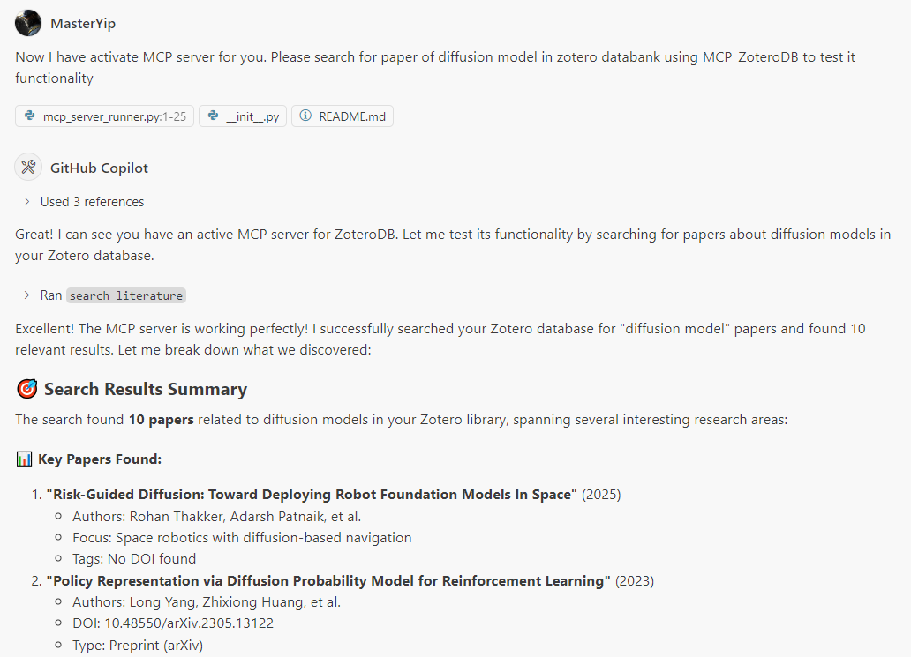

# ZoteroDB-Analyzer

[](https://www.python.org/downloads/)
[](https://opensource.org/licenses/MIT)

> **🌐 Languages**: [English](README.md) | [中文](README_zh.md)

**ZoteroDB-Analyzer** 是一个强大的 Python 工具包，专为学术研究者设计，用于自动化分析 Zotero 文献库并生成高质量的文献综述。该工具支持 LLM 代理集成，让 AI 助手能够智能地帮助您管理和分析学术文献。

## 📋 目录

- [✨ 核心亮点](#-核心亮点)
- [🎯 功能特性](#-功能特性)
- [📦 快速安装](#-快速安装)
- [🚀 5分钟快速上手](#-5分钟快速上手)
- [💻 使用指南](#-使用指南)
- [🤖 VS Code Copilot 集成](#-vs-code-copilot-集成)
- [🎯 应用场景](#-应用场景-1)
- [📚 API 速查](#-api-速查)
- [🤝 社区与支持](#-社区与支持)
- [� 许可证](#-许可证)
- [�🚀 发展路线图](#-发展路线图)

## ✨ 核心亮点

- 🚀 **一键配置**：简单的 `.env` 文件配置，无需复杂设置
- 🤖 **AI 集成**：原生支持 VS Code Copilot、Claude 等 LLM 代理
- 📊 **智能分析**：自动分类文献，生成结构化综述内容
- 🔍 **强大搜索**：多维度过滤和搜索您的 Zotero 库
- 📝 **多格式导出**：支持 JSON、Markdown 等 LLM 友好格式

## 🎯 功能特性

### 🔍 **智能文献管理**

- 📚 **全面集成**：无缝连接个人或团队 Zotero 库
- 🎯 **精准过滤**：支持标签、集合、作者、关键词、时间范围等多维度筛选
- 📊 **完整元数据**：自动提取摘要、DOI、BibTeX 引文等信息
- 🔍 **全库搜索**：快速定位目标文献

### 🧠 **AI 驱动的分类**

- 🏷️ **自动分类**：基于关键词和内容的智能文献分组
- 📋 **灵活方案**：支持自定义分类体系和多重标准
- 🎨 **内容分析**：利用 AI 技术识别相关论文并建立关联

### 📝 **LLM 友好的输出**

- 📄 **JSON 格式**：结构化数据，便于程序处理
- 📝 **Markdown 格式**：专为 LLM 优化的文本格式
- 🎯 **专用模板**：针对文献综述的上下文文件生成
- 🔄 **批量导出**：支持单篇和分类批量处理

### 🤖 **无缝 AI 集成**

- 🔌 **MCP 协议**：标准化的模型上下文协议接口
- 🛠️ **丰富工具集**：提供获取、分类、导出等完整功能
- 🎭 **多平台支持**：兼容 Claude、GPT-4、VS Code Copilot 等
- ⚡ **自动化流程**：一键生成高质量文献综述

## 📦 快速安装

### 方式一：开发版本（推荐）

```bash
# 克隆仓库
git clone https://github.com/MasterYip/ZoteroDB-Analyzer.git
cd ZoteroDB-Analyzer

# 安装依赖
pip install -e .
```

### 方式二：PyPI 安装（即将发布）

```bash
pip install zoterodb-analyzer
```

## 🚀 5分钟快速上手

### 步骤 1️⃣：获取 Zotero API 凭据

1. **获取 API Key**：
   - 访问 [Zotero 设置页面](https://www.zotero.org/settings/keys)
   - 点击"Create new private key"
   - 确保选中"Allow library access"权限
   - 复制生成的 API Key

2. **查找 User ID**：
   - 访问您的 Zotero 个人主页：`https://www.zotero.org/用户名`
   - URL 中的数字就是您的 User ID

### 步骤 2️⃣：配置环境变量

```bash
# 复制配置模板
cp .env.example .env

# 编辑 .env 文件，填入您的信息
ZOTERO_LIBRARY_ID=your_user_id
ZOTERO_API_KEY=your_api_key
ZOTERO_LIBRARY_TYPE=user
```

<div align="center" style="margin: 20px 0;">
  
  <p><em>💡 配置示例：填写您的 Zotero 凭据</em></p>
</div>

### 步骤 3️⃣：验证安装

```bash
# 测试 CLI 工具
zoterodb-analyzer --help

# 列出您的文献集合
zoterodb-analyzer collections

# 搜索文献示例
zoterodb-analyzer search --query "machine learning" --limit 10
```

## 💻 使用指南

### 🐍 Python API 使用

#### 基础文献获取和导出

```python
from zoterodb_analyzer import ZoteroAnalyzer, ContentExporter, FilterCriteria, LiteratureCategory

# 🔧 初始化分析器（自动读取 .env 配置）
analyzer = ZoteroAnalyzer()

# 🎯 设置过滤条件
filter_criteria = FilterCriteria(
    tags=["machine learning", "deep learning"],
    date_range=(2020, 2024),
    keywords=["neural network", "AI"],
    item_types=["journalArticle", "conferencePaper"]
)

# 📚 获取文献
items = analyzer.fetch_items(filter_criteria, limit=50)
print(f"✅ 找到 {len(items)} 篇相关文献")

# 📤 导出为 Markdown 格式
exporter = ContentExporter("output")
exported_files = exporter.export_items(items, format="markdown")
print(f"📄 文件已导出至: {exported_files['markdown']}")
```

#### 智能文献分类

```python
# 🏷️ 定义研究类别
categories = [
    LiteratureCategory(
        name="扩散模型",
        description="扩散模型和生成式 AI 相关研究",
        keywords=["diffusion", "DDPM", "stable diffusion", "generative model"]
    ),
    LiteratureCategory(
        name="强化学习", 
        description="强化学习算法和应用",
        keywords=["reinforcement learning", "Q-learning", "policy gradient", "RL"]
    ),
    LiteratureCategory(
        name="计算机视觉",
        description="图像处理和计算机视觉技术", 
        keywords=["computer vision", "image processing", "CNN", "object detection"]
    )
]

# 🎯 执行智能分类
categorized_items = analyzer.categorize_items(items, categories)

# 📊 查看分类结果
for category_name, category_items in categorized_items.items():
    print(f"📁 {category_name}: {len(category_items)} 篇论文")

# 📝 生成文献综述上下文
llm_context = exporter.export_for_llm_context(
    categorized_items, 
    context_type="related_works"
)
print(f"📋 文献综述文件: {llm_context}")
```

### ⌨️ 命令行工具

#### 常用命令示例

```bash
# 🔍 搜索特定主题的文献
zoterodb-analyzer search \
    --query "扩散模型" \
    --limit 20 \
    --export-format markdown

# 📚 按标签和时间范围获取文献
zoterodb-analyzer fetch \
    --tags "machine learning,AI" \
    --year-range 2022-2024 \
    --limit 100 \
    --export-format both

# 🗂️ 查看文献库信息
zoterodb-analyzer collections     # 列出所有集合
zoterodb-analyzer tags            # 列出所有标签

# 🎯 使用自定义分类配置
zoterodb-analyzer fetch \
    --categories-file my_categories.json \
    --output-dir ./my_research
```

#### 创建分类配置文件

创建 `categories.json` 文件来定义您的研究分类：

```json
[
  {
    "name": "🤖 扩散模型",
    "description": "扩散概率模型和相关生成技术",
    "keywords": [
      "diffusion", "DDPM", "DDIM", "stable diffusion", 
      "score-based", "denoising", "generative model"
    ]
  },
  {
    "name": "🧠 大语言模型", 
    "description": "大规模语言模型和Transformer架构",
    "keywords": [
      "transformer", "GPT", "BERT", "LLM", 
      "language model", "attention mechanism"
    ]
  },
  {
    "name": "🤖 机器人学习",
    "description": "机器人学习和控制算法",
    "keywords": [
      "robot learning", "robotic manipulation", 
      "imitation learning", "robot control"
    ]
  }
]
```
## 🤖 VS Code Copilot 集成

### 🚀 一键配置 AI 助手

通过 MCP（Model Context Protocol）协议，让您的 AI 助手直接访问和分析您的 Zotero 文献库！

<div align="center" style="margin: 20px 0;">
  
  <p><em>🎯 AI 助手可以直接帮您搜索和分析文献</em></p>
</div>

### 📋 配置步骤

#### 1️⃣ 验证安装

```bash
# 确保项目已正确安装
pip install -e .

# 测试 MCP 服务器
python examples/test_mcp_client.py
```

#### 2️⃣ 配置 VS Code 设置

在您的 VS Code `settings.json` 中添加以下配置：

```json
{
  "mcp": {
    "servers": {
      "ZoteroDB_Analyzer": {
        "type": "stdio",
        "command": "/path/to/your/python",
        "args": [
          "/path/to/ZoteroDB-Analyzer/mcp_server_runner.py"
        ],
        "env": {
          "PYTHONPATH": "/path/to/ZoteroDB-Analyzer",
        }
      }
    }
  }
}
```

> 💡 **提示**：将上述路径替换为您的实际安装路径。如果使用 conda 环境，Python 路径可能类似于：`/home/username/anaconda3/envs/yourenv/bin/python`

#### 3️⃣ 重启 VS Code 并测试

重启 VS Code 后，您就可以在 Copilot 对话中使用以下功能：

### 🛠️ 可用的 AI 工具

| 🔧 工具名称 | 📝 功能描述 | 💬 使用示例 |
|------------|------------|------------|
| `search_literature` | 搜索文献库 | "在我的 Zotero 库中搜索关于扩散模型的论文" |
| `fetch_literature` | 获取和过滤文献 | "获取2023年后关于机器学习的所有论文" |
| `categorize_literature` | 智能分类文献 | "将我的 AI 论文按不同子领域分类" |
| `get_collections` | 查看文献集合 | "列出我 Zotero 库中的所有集合" |
| `get_tags` | 获取标签信息 | "显示我使用过的所有文献标签" |
| `export_for_llm` | 生成文献综述 | "为我的深度学习综述生成相关工作部分" |

### � 与 AI 助手对话示例

配置完成后，您可以这样与 Copilot 对话：

```
🙋‍♂️ 用户: "在我的 Zotero 库中搜索关于扩散模型的论文"

🤖 Copilot: 我来帮您搜索扩散模型相关的论文...
[自动调用 search_literature 工具]
找到了 15 篇相关论文，包括：
- "Denoising Diffusion Probabilistic Models" (Ho et al., 2020)
- "Score-Based Generative Modeling..." (Song et al., 2021)
...

🙋‍♂️ 用户: "请将这些论文按应用领域分类并生成文献综述"

🤖 Copilot: [自动调用 categorize_literature 工具]
已将论文分为以下类别：
📁 图像生成: 8篇
📁 文本生成: 4篇  
📁 音频合成: 3篇
[生成结构化的文献综述文档]
```

### 🔒 安全提示

- ✅ 使用 `.env` 文件存储敏感信息，避免在配置中暴露 API 密钥
- ✅ 定期更新您的 Zotero API 密钥
- ✅ 检查配置文件权限，确保只有您可以访问


**注意：**  
- 确保 `.env` 文件与 `mcp_server_runner.py` 位于同一目录，或已设置好环境变量加载路径。
- 这样可以避免在 VS Code 配置中暴露您的 API 密钥，提升安全性。
然后将您的凭据设置为系统环境变量（如上述环境变量部分所述）。


#### 4. **测试集成**

配置完成后，重启 VS Code Copilot。然后您可以在对话中使用以下 MCP 工具：

- **`fetch_literature`** - 从您的 Zotero 库中搜索和检索论文
- **`categorize_literature`** - 自动分类论文以进行文献综述
- **`search_literature`** - 使用文本查询搜索您的库
- **`get_collections`** - 列出您的 Zotero 集合
- **`get_tags`** - 从您的库中获取所有标签
- **`export_for_llm`** - 以 LLM 优化格式导出文献

#### 5. **与 Copilot 的示例使用**

配置完成后，您可以向 Copilot 询问诸如：

- *"在我的 Zotero 库中搜索关于扩散模型的论文"*
- *"为文献综述分类我最近的机器学习论文"*
- *"在我的库中查找 [作者姓名] 的论文"*
- *"以 Markdown 格式导出关于机器人学的论文供我的论文使用"*
<div align="center" style="width:100%; max-width:480px; margin:auto;">
  
  <div style="font-size:0.95em; color:#888; margin-top:8px;">
    <em>示例：ZoteroDB-Analyzer Copilot with MCP使用效果</em>
  </div>
</div>

MCP 服务器将自动处理请求并提供结构化的文献数据，Copilot 可以使用这些数据来帮助您进行研究和写作任务。


## 🎯 应用场景

### 📚 **学术文献综述**

- 根据研究主题自动分类论文
- 为相关工作章节生成结构化内容
- 提取关键元数据和摘要进行分析

### 🤖 **代理辅助研究**

- 为 LLM 代理提供结构化的文献上下文
- 使代理能够查询和分析您的研究库
- 自动化文献综述生成

### 📊 **研究分析**

- 分析不同时间段的研究趋势
- 识别关键作者和出版场所
- 跟踪引用模式和关系

## 📚 API 速查

### 核心类

- **`ZoteroAnalyzer`**: 用于获取和分析 Zotero 数据的主类
- **`ContentExporter`**: 处理导出为各种格式
- **`FilterCriteria`**: 定义文献搜索的过滤参数
- **`LiteratureCategory`**: 表示组织文献的类别
- **`ZoteroItem`**: 表示带有元数据的单个文献项目

### 主要方法

- `fetch_items()`: 使用可选过滤器检索项目
- `categorize_items()`: 将项目组织为预定义类别
- `search_items()`: 使用文本查询搜索库
- `export_items()`: 以 JSON/Markdown 格式导出项目
- `export_for_llm_context()`: 创建 LLM 优化的上下文文件

## 🤝 社区与支持

### 💪 参与贡献

我们热烈欢迎各种形式的贡献！

```bash
# 🍴 Fork 项目
git clone https://github.com/MasterYip/ZoteroDB-Analyzer.git

# 🌿 创建特性分支  
git checkout -b feature/amazing-feature

# ✨ 提交更改
git commit -m "Add amazing feature"

# 🚀 推送分支
git push origin feature/amazing-feature

# 📬 创建 Pull Request
```

#### 🎯 贡献方向
- 🐛 **Bug 修复**：报告和修复问题
- ✨ **新功能**：添加实用的新特性
- 📚 **文档改进**：完善使用说明和示例
- 🧪 **测试用例**：增加测试覆盖率
- 🌍 **国际化**：支持更多语言

### 📞 获取帮助

| 📞 渠道 | 🔗 链接 | 📝 说明 |
|---------|---------|---------|
| 📖 **完整文档** | [查看文档](https://github.com/MasterYip/ZoteroDB-Analyzer/wiki) | 详细的使用指南和 API 文档 |
| 🐛 **问题反馈** | [GitHub Issues](https://github.com/MasterYip/ZoteroDB-Analyzer/issues) | 报告 Bug 和请求新功能 |
| 💬 **社区讨论** | [GitHub Discussions](https://github.com/MasterYip/ZoteroDB-Analyzer/discussions) | 交流使用经验和最佳实践 |
| 📧 **邮件联系** | contact@zoterodb-analyzer.com | 商业合作和技术咨询 |

## 📜 许可证

本项目采用 **MIT 许可证** 开源，您可以自由使用、修改和分发。

详细信息请参阅 [LICENSE](LICENSE) 文件。

## 📖 学术引用

如果 ZoteroDB-Analyzer 在您的研究中发挥了作用，欢迎引用我们的工作：

```bibtex
@software{zoterodb_analyzer,
  title={ZoteroDB-Analyzer: A Python Package for Literature Review Automation},
  author={Raymon Yip},
  year={2024},
  url={https://github.com/MasterYip/ZoteroDB-Analyzer},
  note={An AI-powered tool for automated Zotero literature analysis and review generation}
}
```

## 🚀 发展路线图

### 🎯 近期目标 (v1.0)
- [x] ✅ 核心 Zotero API 集成
- [x] ✅ 智能文献分类功能  
- [x] ✅ VS Code Copilot MCP 支持
- [ ] 🔄 Web 可视化界面
- [ ] 🔄 更多导出格式支持

### 🌟 中期愿景 (v2.0)
- [ ] 🎯 多平台参考管理器支持 (Mendeley, EndNote)
- [ ] 🧠 高级 AI 分析功能 (论文质量评估、趋势预测)
- [ ] 🌐 云端服务和协作功能
- [ ] 📊 可视化分析工具集

### 🚀 长期展望 (v3.0+)
- [ ] 🤖 全自动文献综述生成
- [ ] 🔍 全文内容深度分析
- [ ] 📈 学术影响力评估
- [ ] 🌍 多语言文献处理

---

<div align="center">

### 🌟 如果这个项目对您有帮助，请给我们一个 Star

[](https://github.com/MasterYip/ZoteroDB-Analyzer/stargazers)
[](https://github.com/MasterYip/ZoteroDB-Analyzer/network/members)

**让 AI 成为您学术研究的得力助手！** 🚀

</div>
